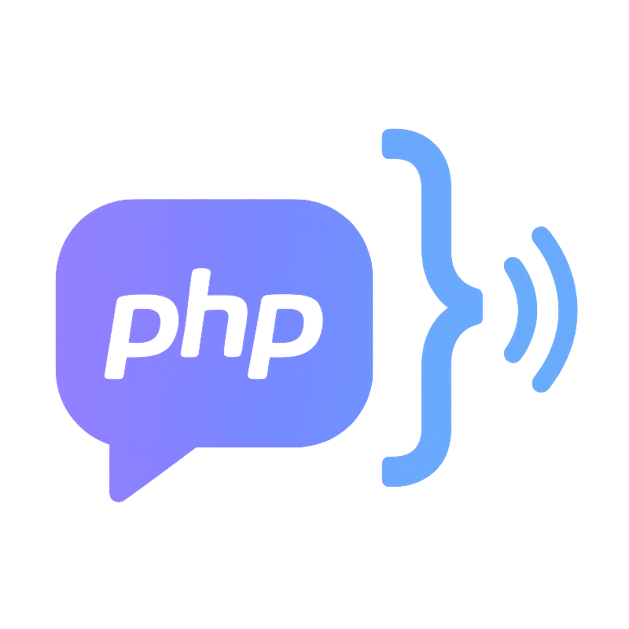

<div align="center">
  
  
  # FluentVox
  
  ### 🎙️ Unleash state‑of‑the‑art text‑to‑speech and voice cloning in your PHP applications with style
  
  [](https://www.php.net/)
  [](https://phpstan.org/)
  [](https://opensource.org/licenses/MIT)
</div>

This standalone, developer‑friendly library brings the full power of Resemble AI’s Chatterbox TTS into a beautifully fluent PHP API. Effortless to use, lightning‑fast, and built for real‑world production environments, it handles everything—from seamless model management to cross‑platform compatibility on Linux, macOS, and Windows.

Whether you're crafting immersive voice experiences, automating audio generation, or building AI‑powered products, this wrapper gives you a clean, modern, and expressive toolkit that makes advanced TTS feel natural.

## ✨ Features

- 🎯 **Fluent API** - Laravel-inspired chainable interface
- 🌍 **Cross-Platform** - Linux, macOS (including Apple Silicon), and Windows support
- 📦 **Automatic Management** - Downloads and manages models automatically
- 🎭 **Voice Cloning** - Clone any voice from a reference audio file
- 🌐 **Multilingual** - Support for 23+ languages
- ⚡ **GPU Acceleration** - CUDA (NVIDIA), MPS (Apple Silicon), or CPU
- 🔒 **Type-Safe** - Full PHP 8.3+ type hints / PHPStan level 6
- 🛠️ **Complete CLI** - Command-line tools for installation and generation
- 🧪 **Tests** - Complete test suite with Pest PHP 4

## 📦 Installation

```bash
composer require b7s/fluentvox
```

### Install Dependencies

After installing the package, install Python dependencies:

```bash
vendor/bin/fluentvox install
```

This will:

- Verify Python 3.10+ is installed
- Install Chatterbox TTS package
- Detect GPU acceleration (CUDA/MPS)

### Using Python Virtual Environments (venv)

FluentVox **automatically detects** Python virtual environments. It will prioritize:

1. **Active venv** (via `VIRTUAL_ENV` environment variable)
2. **Local venv directories** (`.venv`, `venv`, `venv311`, etc.) in current directory and parent directories
3. **System Python** (fallback)

**Recommended workflow:**

```bash
# Create a virtual environment (if you don't have one)
python3 -m venv venv

# Activate it (optional, but recommended)
source venv/bin/activate  # Linux/macOS
# or
venv\Scripts\activate     # Windows

# Install FluentVox dependencies in the venv
vendor/bin/fluentvox install
```

**Manual configuration:**

If FluentVox doesn't detect your venv automatically, specify the Python path in `fluentvox-config.php`:

```php
return [
    'python_path' => '/path/to/venv/bin/python',  // Linux/macOS
    // or
    'python_path' => 'C:\\path\\to\\venv\\Scripts\\python.exe',  // Windows
    // ...
];
```

### Check Installation

```bash
vendor/bin/fluentvox doctor
```

## 🚀 Quick Start

### Basic Usage

```php
use B7s\FluentVox\FluentVox;

$result = FluentVox::make()
    ->text('Hello, world! This is FluentVox speaking.')
    ->generate();

echo "Audio saved to: " . $result->outputPath;
echo "Duration: " . $result->getFormattedDuration();
```

### Voice Cloning

```php
$result = FluentVox::make()
    ->text('Hello, I sound just like the reference!')
    ->voiceFrom('/path/to/reference.wav')
    ->generate();
```

### Multilingual

```php
use B7s\FluentVox\Enums\Language;

$result = FluentVox::make()
    ->multilingual()
    ->text('Bonjour le monde!')
    ->language(Language::French)
    ->generate();
```

### Expressive Speech

```php
$result = FluentVox::make()
    ->text('Wow, this is absolutely amazing!')
    ->expressive()
    ->slow()
    ->generate();
```

## 🛠️ CLI Commands

### install - Install Dependencies

```bash
# Basic installation
vendor/bin/fluentvox install

# Install with PyTorch
vendor/bin/fluentvox install --pytorch

# Upgrade existing packages
vendor/bin/fluentvox install --upgrade
```

### doctor - Diagnose Installation

```bash
# Basic diagnosis
vendor/bin/fluentvox doctor

# Download default model if not available
vendor/bin/fluentvox doctor --download-default
```

The `doctor` command checks your installation and shows:

- Platform compatibility
- Python and dependency status
- Model availability
- **Default model detection**: Identifies your configured default model and suggests downloading it if not available

### models - Manage Models

```bash
# List available models
vendor/bin/fluentvox models

# Download a specific model
vendor/bin/fluentvox models download --model=chatterbox

# Download all models
vendor/bin/fluentvox models download --all
```

### generate - Generate Speech

```bash
# Basic generation (uses default model from config)
vendor/bin/fluentvox generate "Hello, world!"

# Save to specific file
vendor/bin/fluentvox generate "Hello, world!" -o output.wav

# Specify a different model
vendor/bin/fluentvox generate "Hello!" --model=chatterbox-turbo

# With voice cloning
vendor/bin/fluentvox generate "Hello!" --voice=reference.wav

# Multilingual
vendor/bin/fluentvox generate "Bonjour!" -m chatterbox-multilingual -l fr
```

**Note:** If you don't specify `--model`, the command will use the `default_model` from your `fluentvox-config.php` file.

## 📖 API Reference

### Model Selection

Choose which Chatterbox model to use based on your needs. Each model has different capabilities, performance characteristics, and language support.

```php
// Standard English model (500M params)
FluentVox::make()->standard()  // Best for general use with emotion controls

// Turbo model - faster, with paralinguistic tags (350M params)
FluentVox::make()->turbo()  // Fastest, supports [laugh], [cough] tags

// Multilingual model - 23+ languages (500M params)
FluentVox::make()->multilingual()  // For non-English languages
```

### Voice Cloning

Clone any voice by providing a reference audio sample. The model will mimic the speaker's voice characteristics, tone, and speaking style in the generated speech.

```php
// Clone voice from reference audio
->voiceFrom('/path/to/reference.wav')  // Use this person's voice

// Alias
->cloneVoice('/path/to/reference.wav')

// Use default voice
->defaultVoice()  // Use model's built-in voice
```

### Language (Multilingual Model)

Specify the target language when using the multilingual model. The model will generate speech with native pronunciation and intonation for the selected language.

```php
use B7s\FluentVox\Enums\Language;

->language(Language::French)
->language(Language::Japanese)
->language(Language::Portuguese)

// Shortcuts for common languages
->english()
->french()
->spanish()
->german()
->portuguese()
->japanese()
->chinese()
```

**Supported Languages:** Arabic, Danish, German, Greek, English, Spanish, Finnish, French, Hebrew, Hindi, Italian, Japanese, Korean, Malay, Dutch, Norwegian, Polish, Portuguese, Russian, Swedish, Swahili, Turkish, Chinese ([see more details](https://github.com/resemble-ai/chatterbox?tab=readme-ov-file#supported-languages))

### Expression Controls

Control the emotional intensity and expressiveness of the generated speech. Higher values produce more dramatic, animated voices while lower values create calmer, more subdued speech.

```php
// Exaggeration (0.25-2.0, neutral=0.5)
->exaggeration(0.7)

// Presets
->neutral()      // 0.5 - Balanced, natural expression
->expressive()   // 0.7 - More animated and emotional
->dramatic()     // 1.0 - Highly expressive, theatrical
->subtle()       // 0.3 - Understated, calm delivery
```

### Pace/CFG Controls

Adjust the rhythm and speed of speech delivery. CFG (Classifier-Free Guidance) weight controls how closely the model follows the text pacing. Lower values create slower, more deliberate speech while higher values speed up delivery.

```php
// CFG weight (0.2-1.0, default=0.5)
->cfgWeight(0.4)
->pace(0.4)  // alias

// Presets
->slow()        // 0.3 - Deliberate, measured pacing
->normalPace()  // 0.5 - Natural speaking speed
->fast()        // 0.7 - Quick, energetic delivery
```

### Randomness Controls

Control the variability and creativity in speech generation. Temperature affects how predictable vs. varied the output is. Seeds allow you to reproduce exact results.

```php
// Temperature (0.05-5.0, default=0.8)
->temperature(0.6)

// Presets
->deterministic()  // 0.3 - Consistent, predictable output
->creative()       // 1.2 - More varied, spontaneous speech

// Seed for reproducibility (0 = random)
->seed(42)  // Use same seed to get identical results
```

### Audio Processing

Configure how reference audio is processed for voice cloning. VAD (Voice Activity Detection) can remove silence and background noise from reference clips.

```php
// Trim silence from reference audio
->trimSilence()  // Remove silence/noise from voice sample

// Keep silence (default)
->keepSilence()  // Use reference audio as-is
```

### Device Selection

Choose which hardware to use for audio generation. GPU acceleration (CUDA/MPS) is significantly faster than CPU but requires compatible hardware.

```php
// Auto-detect best device (default)
->autoDevice()  // Automatically selects CUDA > MPS > CPU

// Force CUDA (NVIDIA GPU)
->cuda()  // Use NVIDIA GPU (Linux/Windows)

// Force MPS (Apple Silicon)
->mps()  // Use Apple Metal (M1/M2/M3 Macs)

// Force CPU
->cpu()  // Use CPU only (slower but always available)
```

### Output Configuration

Configure where and how the generated audio is saved, with options for timeouts and progress monitoring.

```php
// Set output path
->saveTo('/path/to/output.wav')  // Save to specific location
->output('/path/to/output.wav')  // alias

// Set timeout (seconds)
->timeout(600)  // Maximum time to wait for generation

// Enable verbose output
->verbose()  // Show detailed generation logs

// Progress callback
->onProgress(function (string $output, bool $isError) {
    echo $output;  // Monitor generation progress in real-time
})
```

### Presets

Pre-configured combinations of settings optimized for common use cases. These presets adjust expression, pace, and temperature for specific scenarios.

```php
// Narration: clear, neutral, consistent
->forNarration()  // Audiobook narration, documentation

// Dialogue: expressive, varied
->forDialogue()  // Character voices, conversations

// Voice agents: fast, clear, low latency
->forVoiceAgent()  // Chatbots, virtual assistants

// Audiobooks: dramatic, varied pacing
->forAudiobook()  // Long-form storytelling
```

### Execution

Generate the audio file or retrieve raw audio data for further processing.

```php
// Generate and save to file
$result = FluentVox::make()
    ->text('Hello!')
    ->generate();  // Returns GenerationResult object

// Generate and get raw audio data
$audioData = FluentVox::make()
    ->text('Hello!')
    ->generateRaw();  // Returns raw WAV bytes as string
```

### Audio Conversion

Convert generated audio to different formats using FFmpeg. All conversion methods generate the audio first, then convert it. The format is automatically detected from the file extension.

```php
// Universal method - format detected from extension
$result = FluentVox::make()
    ->text('Hello!')
    ->convertTo('/path/to/output.mp3');  // Auto-detects MP3

$result = FluentVox::make()
    ->text('Hello!')
    ->convertTo('/path/to/output.m4a', ['bitrate' => 128]);

// Specific format methods
$result = FluentVox::make()
    ->text('Hello!')
    ->convertToMp3('/path/to/output.mp3', bitrate: 192);

$result = FluentVox::make()
    ->text('Hello!')
    ->convertToM4a('/path/to/output.m4a', bitrate: 128);

$result = FluentVox::make()
    ->text('Hello!')
    ->convertToOgg('/path/to/output.ogg', quality: 5);

$result = FluentVox::make()
    ->text('Hello!')
    ->convertToOpus('/path/to/output.opus', bitrate: 96);

$result = FluentVox::make()
    ->text('Hello!')
    ->convertToFlac('/path/to/output.flac');

// Convert and delete original WAV
$result = FluentVox::make()
    ->text('Hello!')
    ->convertTo('/path/to/output.mp3', deleteOriginal: true);

// Manual conversion of existing file
FluentVox::convertAudio(
    'input.wav',
    'output.mp3',
    'mp3',
    ['bitrate' => 320]
);

// Get audio file information
$info = FluentVox::getAudioInfo('audio.mp3');
// Returns: ['duration', 'sample_rate', 'channels', 'codec', 'bitrate']
```

**Supported Formats:**

- **MP3**: Universal compatibility, good compression (bitrate: 64-320 kbps)
- **M4A/AAC**: Apple devices, slightly better quality than MP3 (bitrate: 64-256 kbps)
- **OGG Vorbis**: Web streaming, open format (quality: 0-10)
- **Opus**: Best compression for voice, modern browsers (bitrate: 32-256 kbps)
- **FLAC**: Lossless compression, archival quality

### Result Object

The GenerationResult object contains information about the generated audio and metadata about the generation process.

```php
$result = FluentVox::make()->text('Hello!')->generate();

$result->isSuccessful();           // bool - Check if generation succeeded
$result->getPath();                // string - Output file path
$result->getDuration();            // float - Duration in seconds
$result->getFormattedDuration();   // string - "00:02.50" format
$result->sampleRate;               // int - 24000 Hz
$result->text;                     // string - Original input text
$result->error;                    // string|null - Error message if failed
$result->metadata;                 // array - Generation parameters used
$result->toArray();                // array - All data as array
```

### Static Helpers

Utility methods for system checks, installation, model management, and audio conversion without creating a FluentVox instance.

```php
// Check system requirements
$results = FluentVox::checkRequirements();  // Verify Python, PyTorch, etc.

// Install Chatterbox TTS
FluentVox::install(function ($output, $isError) {
    echo $output;  // Monitor installation progress
});

// List available models
$models = FluentVox::listModels();  // Get all models with download status

// Convert existing audio file
FluentVox::convertAudio('input.wav', 'output.mp3', 'mp3', ['bitrate' => 192]);

// Get audio file information
$info = FluentVox::getAudioInfo('audio.mp3');
// Returns: ['duration' => 5.2, 'sample_rate' => 44100, 'channels' => 2, ...]
```

## ⚙️ Configuration

Create a `fluentvox-config.php` file in your project root:

```php
<?php

return [
    // Python executable path (null = auto-detect)
    // FluentVox automatically detects venv, but you can specify manually:
    // 'python_path' => '/path/to/venv/bin/python',  // Linux/macOS
    // 'python_path' => 'C:\\path\\to\\venv\\Scripts\\python.exe',  // Windows
    'python_path' => null,

    // Directory where models will be stored
    'models_path' => null, // null = ~/.cache/huggingface/hub

    // Default model: 'chatterbox', 'chatterbox-turbo', 'chatterbox-multilingual'
    // This model will be used automatically by CLI commands and FluentVox instances
    'default_model' => 'chatterbox',

    // Default device: 'auto', 'cuda', 'mps', 'cpu'
    'device' => 'auto',

    // Default output directory
    'output_path' => null, // null = current working directory

    // Default audio format
    'audio_format' => 'wav',

    // Generation defaults
    'defaults' => [
        'exaggeration' => 0.5,
        'temperature' => 0.8,
        'cfg_weight' => 0.5,
        'seed' => 0,
    ],

    // Process timeout in seconds
    'timeout' => 300,

    // Enable verbose output
    'verbose' => false,
];
```

**Configuration File Location:**

The configuration file is searched in the following order:

1. Explicit path (if provided programmatically)
2. Project root (where `composer.json` is located)
3. Current working directory
4. Package root (fallback)

**Default Model:**

The `default_model` setting is automatically used by:

- CLI `generate` command when `--model` is not specified
- `FluentVox::make()` instances
- `doctor` command detects and highlights the default model status

To download the default model, run:

```bash
vendor/bin/fluentvox doctor --download-default
```

## 📊 Available Models

| Model                     | Size | Languages | Features                                 | Best For                           |
| ------------------------- | ---- | --------- | ---------------------------------------- | ---------------------------------- |
| `chatterbox`              | 500M | English   | CFG & exaggeration tuning                | General TTS with creative controls |
| `chatterbox-turbo`        | 350M | English   | Paralinguistic tags `[laugh]`, `[cough]` | Voice agents, low latency          |
| `chatterbox-multilingual` | 500M | 23+       | Zero-shot cloning, multiple languages    | Global applications                |

## 📋 Requirements

- PHP 8.3+
- Composer 2+
- Python 3.10+ (system Python or virtual environment)
- PyTorch (auto-installed)
- Chatterbox TTS (auto-installed)
- FFmpeg (for audio conversion)

**Note:** Using a Python virtual environment (venv) is **highly recommended** to avoid conflicts with system packages. FluentVox automatically detects and uses venv when available.

> **Note:** Chatterbox TTS has its own system [requirements and dependencies](https://github.com/resemble-ai/chatterbox#installation). If you encounter installation issues, run `vendor/bin/fluentvox doctor` to diagnose problems, or `vendor/bin/fluentvox install --verbose` for detailed installation logs. Ensure all Python dependencies are properly installed before use.

### GPU Acceleration (Optional)

- **NVIDIA GPU**: CUDA 11.8+ (Linux/Windows)
- **Apple Silicon**: MPS (macOS M1/M2/M3)

## 🌐 Platform Support

| Platform | Architecture                  | GPU Support |
| -------- | ----------------------------- | ----------- |
| Linux    | x86_64, arm64                 | CUDA        |
| macOS    | x86_64, arm64 (Apple Silicon) | MPS         |
| Windows  | x86_64                        | CUDA        |

## Running Tests

### Run tests

```bash
composer test          # Runs all tests
composer test:unit     # Only unit tests
composer test:feature  # Only feature tests
composer test:coverage # With coverage
```

## 📄 License

MIT License - see [LICENSE](LICENSE) file.

## 🙏 Credits

- [Resemble AI](https://resemble.ai) - Chatterbox TTS model
- [b7s/whisper-php](https://github.com/b7s/whisper-php) - Inspiration for API design
- [b7s/YtPilot](https://github.com/b7s/YtPilot) - Inspiration for fluent API
